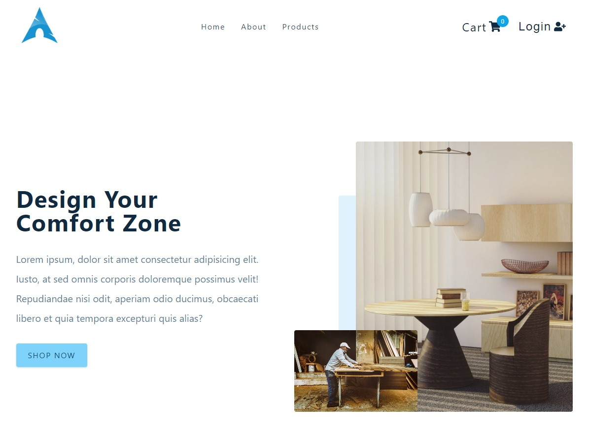
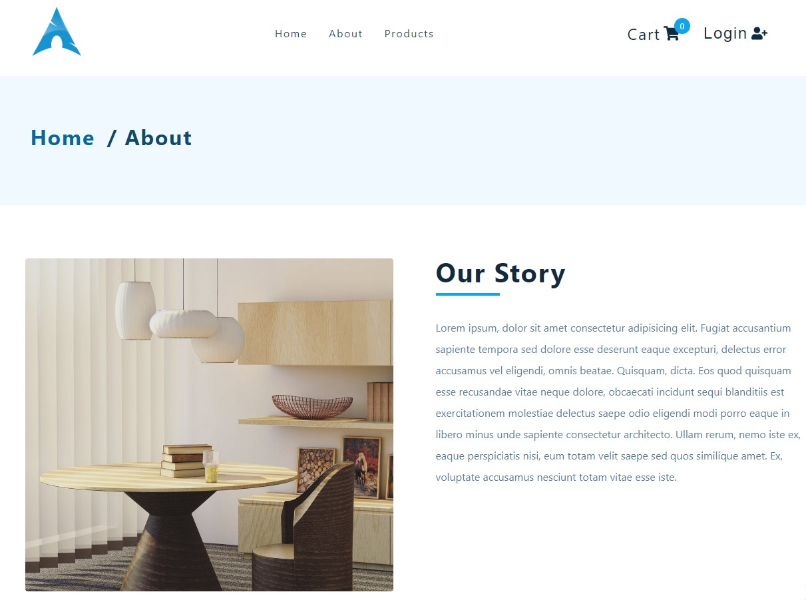
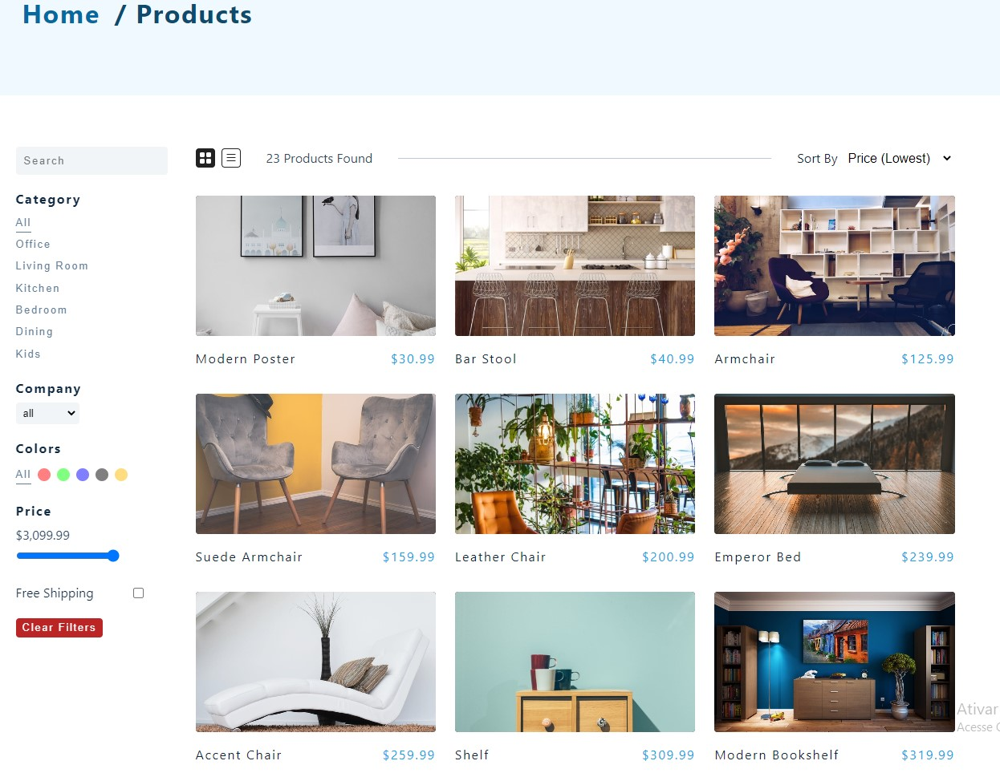
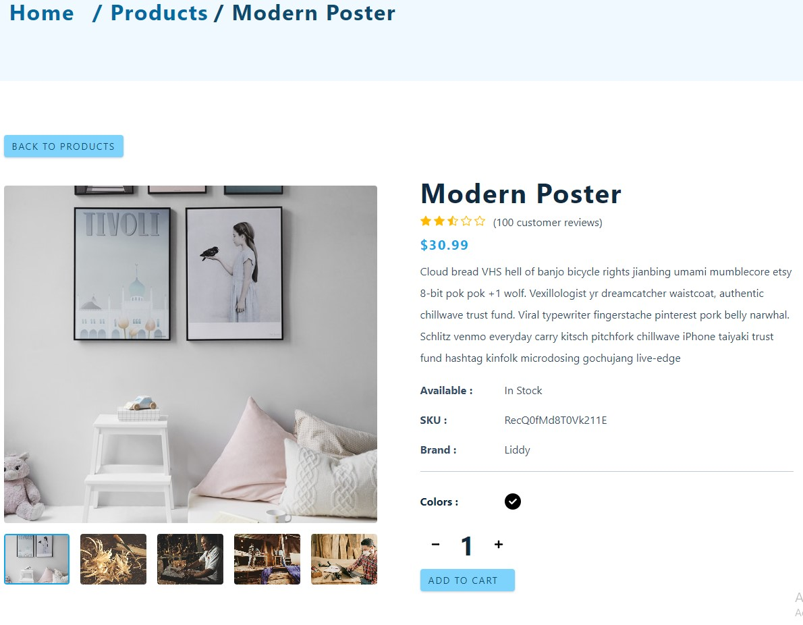
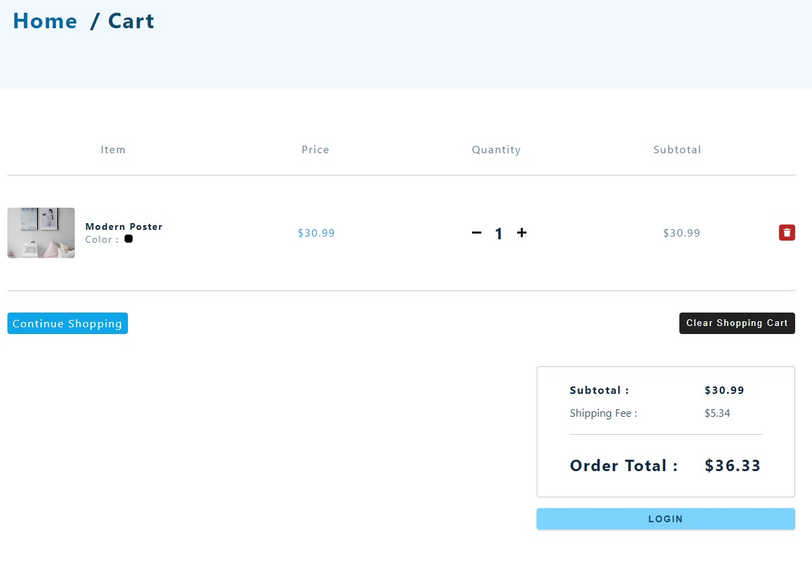
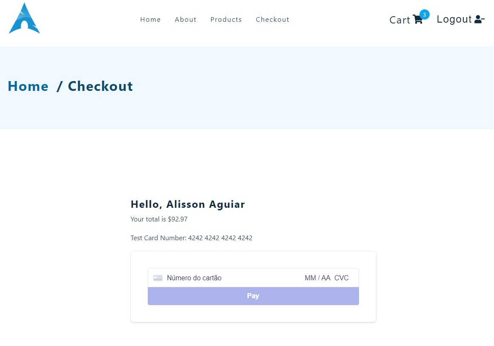

# Comfy Sloth ! 🪑 🎁

 

## E-commerce completo. 🥰 🚀 💻 📚

### [Comfy Sloth](https://react-js-comfy-sloth.netlify.app/) 🔗

## Tecnologias que utilizei para o projeto ;  

 
    
    
    
    

 

##  As funcionalidades:
- Login ;
- logout ;
- Pesquisar prudutos ;
- filtragem de prudutos ;
- Add cart ;
- delete cart ;
## O código foi desenvolvido usando os conceitos ; 
- Hooks ; useState, useEffect, useReducer e useContext ;
- Axios para API com os padrões Restful ;
- As rotas foram criadas com React Router Dom 6.
- Resposivo
## A estilização ; 
- Styled Components; 
## Dependencias ; 
- Auth0 ; 
- Fusion Charts ; 
- Axios ; 
- Dotenv ; 
- Netlify ; 
- React Icons ; 
- Stripe ;
- React Router Dom dentre outros. 
## 🎲 Rodando o Back End (servidor)
- npm install
- npm start
